# audtfio 🎵🔊
audtfio : Audio Classification # Tensorflow

## Objective
- Understanding audio data (sample rate, amplitude, signal, waveform, frequency, channels, frames, offset, spectrogram)
- Visualize & transform audio data
- Build binary classification model from wave files

## Audio Classification with TensorFlow

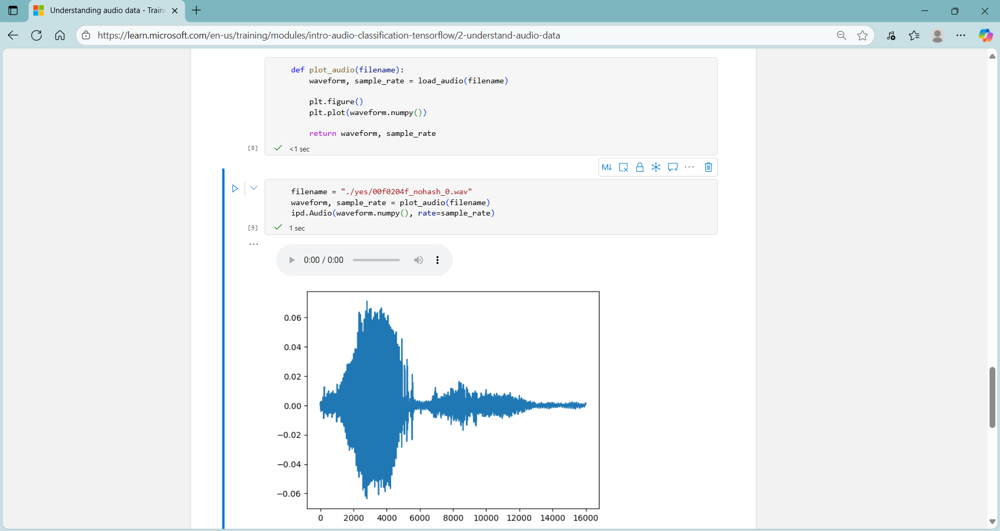

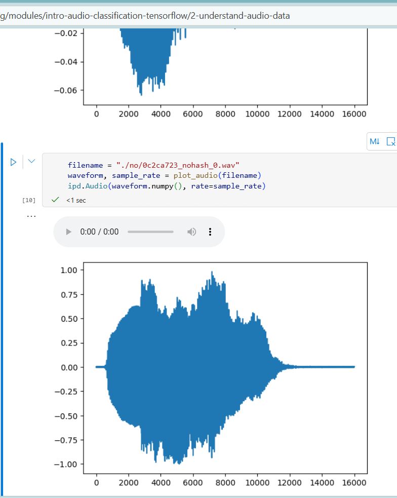

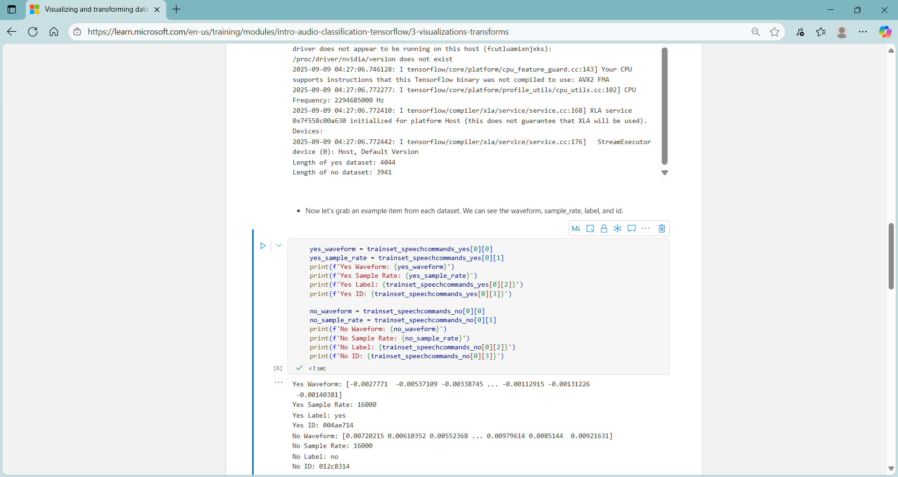

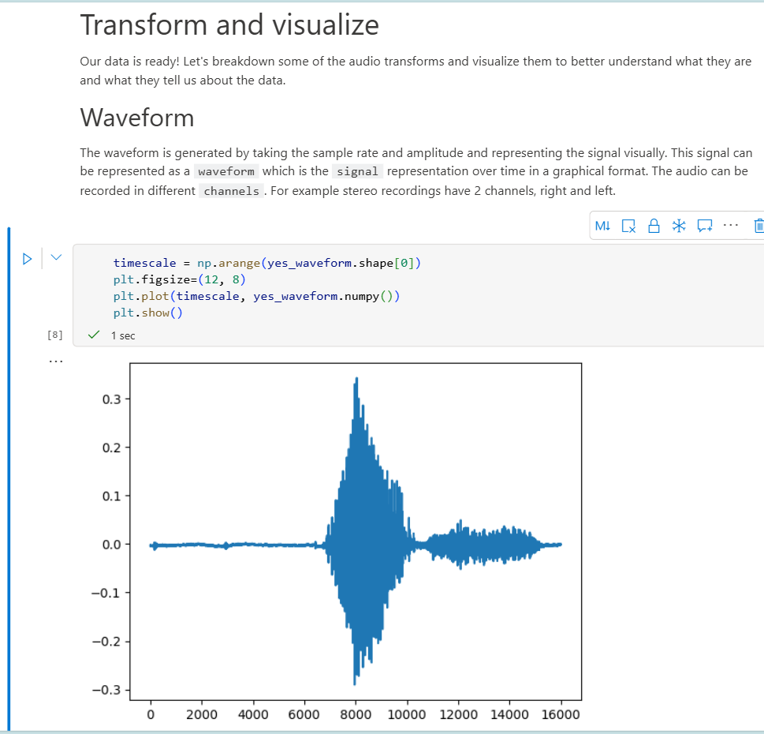

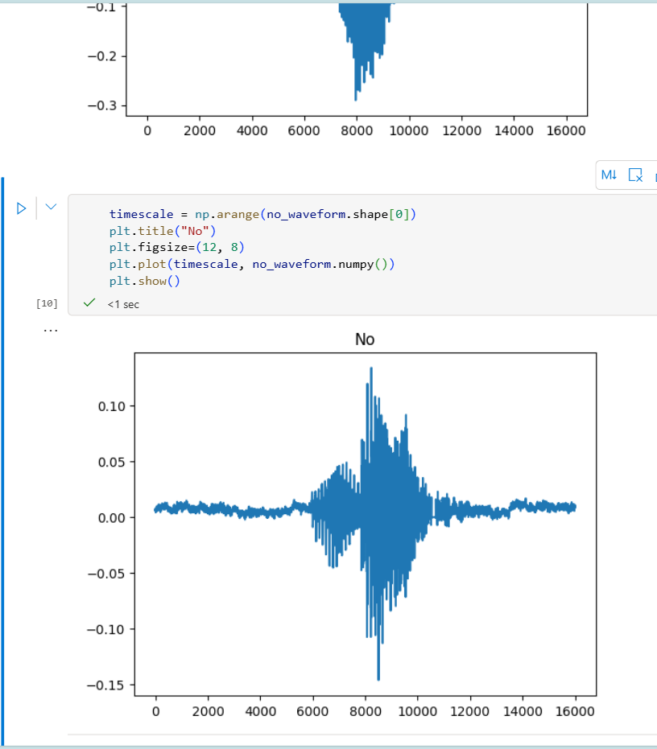

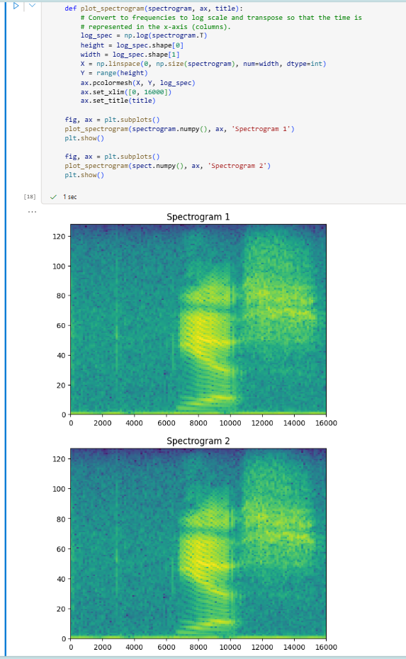

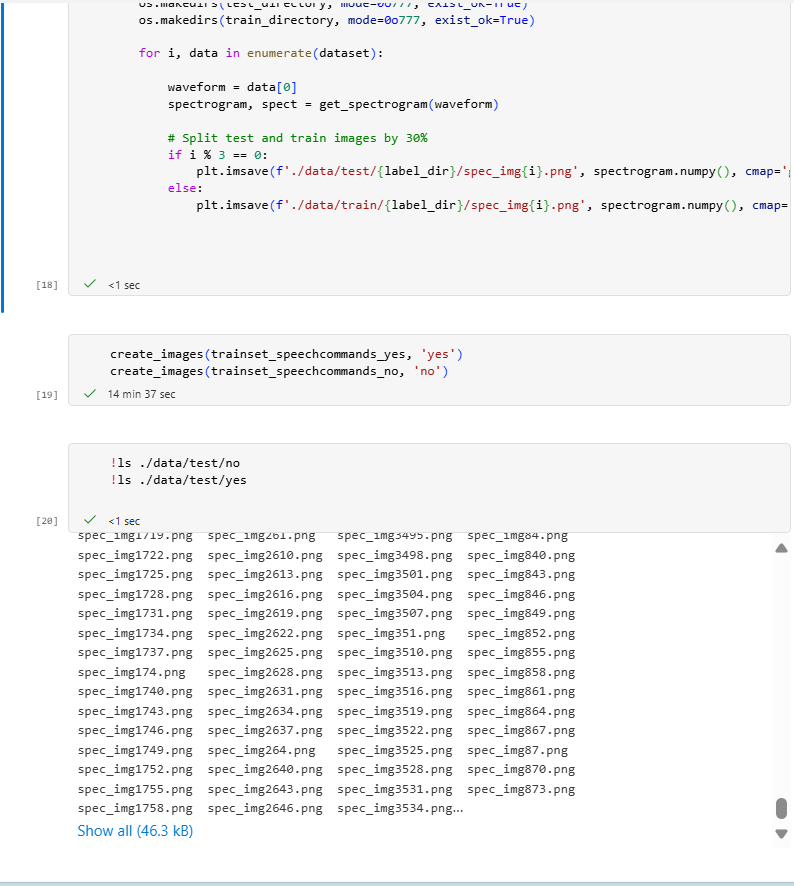

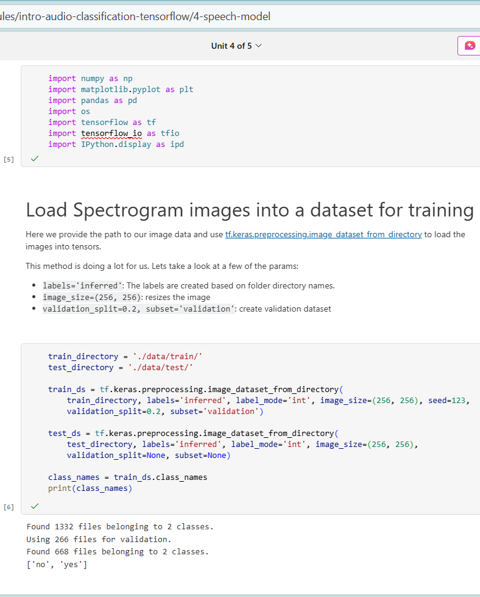

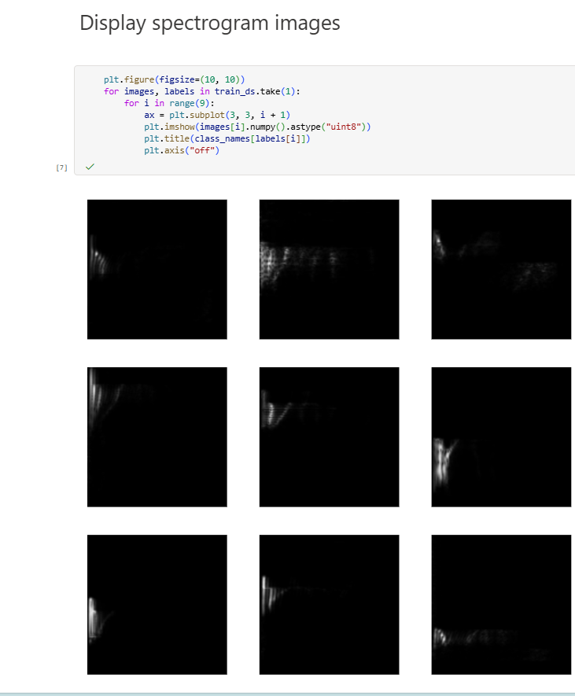

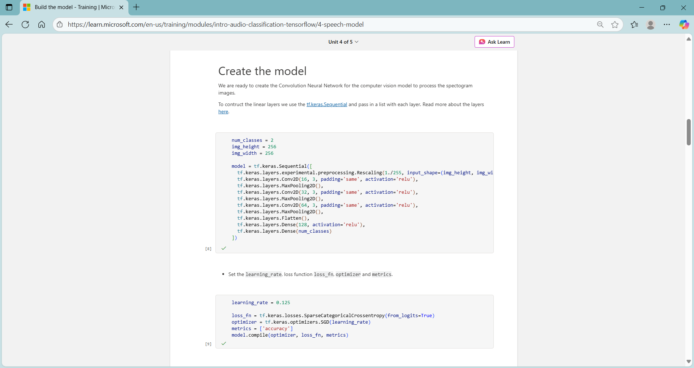

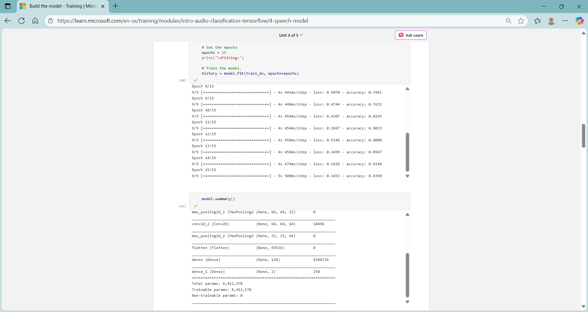

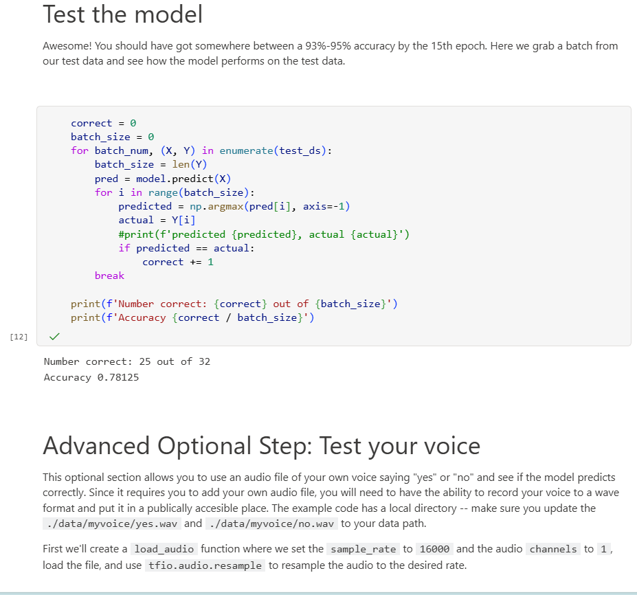

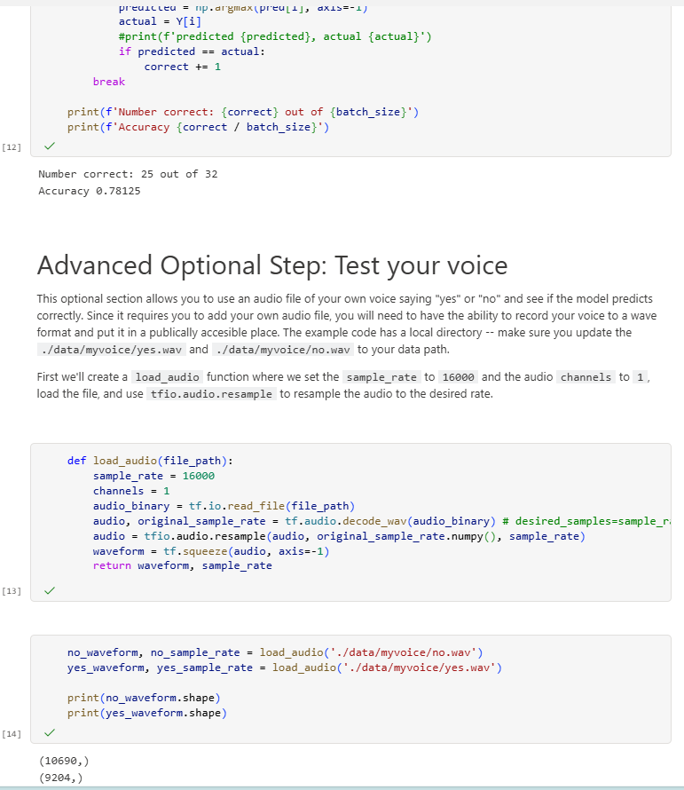

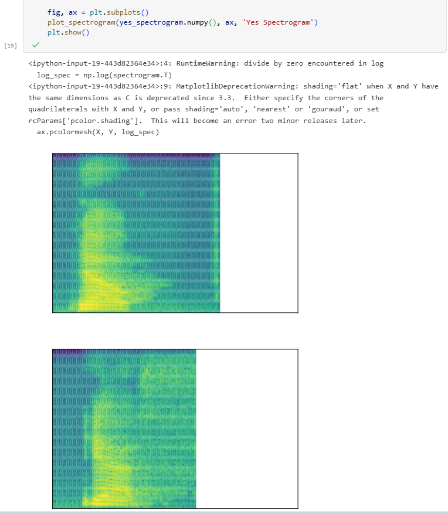

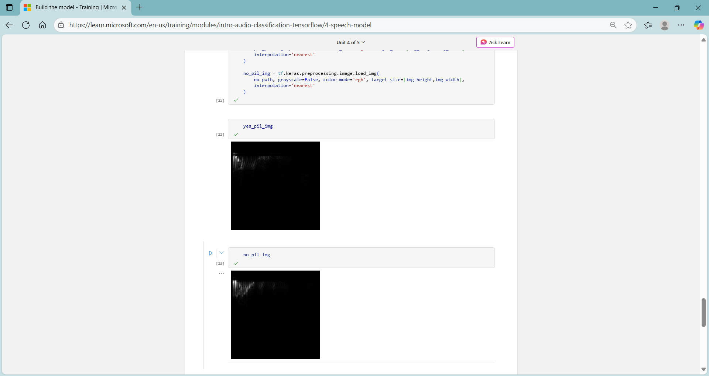

